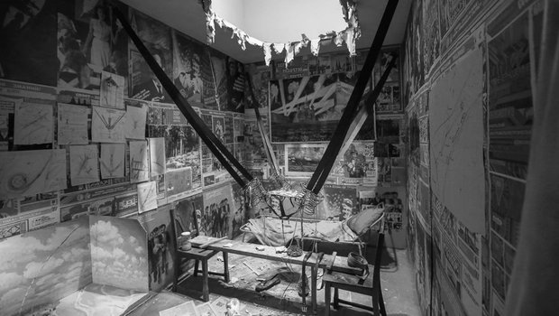

> "Let it go. We have bigger fights."  
> \- Reacher (2022)

# My Projects

Ramunas Girdziusas, aabbtree77 at gmail.com

[CV (React show-off)](https://aabbtree77.github.io/cv/), [resume.pdf](https://aabbtree77.github.io/pdfs/RamunasGirdziusasResume.pdf), [cv.pdf](https://aabbtree77.github.io/pdfs/RamunasGirdziusasCV.pdf)

I studied electrical engineering in Lithuania from 1994 to 1999, researched machine learning in Finland from 2000 to 2008, completed three postdoc projects, and returned in 2014 eyeing [software engineering](https://1x.engineer/).

Take a look at some of my work in [embedded software](https://github.com/aabbtree77/adast), browse for more below.

## [surveillance](https://github.com/aabbtree77/surveillance)

Vilnius, April 2025.

Set up an IP camera with Motion to store videos on Ubuntu 22.04 with motion detected in them. LAN-based tests, would need AnyDesk, RustDesk, or, better, [anywherelan/awl](https://github.com/anywherelan/awl) (P2P) for remote surveillance.

## auth-starter-backend + frontend

Vilnius, June 2024.

A tiny demo [backend](https://github.com/aabbtree77/auth-starter-backend) and [frontend](https://github.com/aabbtree77/auth-starter-frontend) for a 3rd party-free username/password authentication. It includes a memo how to set up browser cookies locally and with the HTTPS.

## [lawtrust.eu](https://lawtrust.eu/)

Vilnius, February 2024.

A multilingual website for a lawyer who speaks nine languages. Tailwind CSS, [gomarkdown](https://github.com/gomarkdown/markdown), porkbun.com, and github pages. This project was an eye opener about the SEO and online visibility.

## [miniguestlog](https://github.com/aabbtree77/miniguestlog)

Vilnius, 2023-2024.

A MERN app to [record](https://aabbtree77.github.io/miniguestlog/loadGuestsSpinner.html) geolocation of the last 50 visitors of aabbtree77.github.io. MongoDB Atlas, Compass, render.com, github pages, ipify.org, and geoip-lite API for the GeoLite data from MaxMind.

## [adast](https://github.com/aabbtree77/adast)

Vilnius, 2020 - 2024.

A joint work with Saulius Rakauskas (Infovega). We have been maintaining a *real* factory machine since February 2020 (last update: February 2024). I wrote microcontroller code in C (avr-gcc).

## [esp32-vpn](https://github.com/aabbtree77/esp32-vpn)

Vilnius, 2021 - 2022.

A joint work with Saulius Rakauskas (Infovega): A remote plant watering system with ESP32, MicroPython, Mosquitto MQTT, Ubuntu and [awl](https://github.com/anywherelan/awl) with golibp2p. Numerous tests of [hole punching](<https://en.wikipedia.org/wiki/Hole_punching_(networking)>) through layers of routers with the use of the P2P network other than torrents, to control an ESP32 device globally, without obscure 3rd party services.

## [twinpeekz](https://github.com/aabbtree77/twinpeekz)

Vilnius, 2020 - 2022.

Volumetric lighting in [Go](https://github.com/aabbtree77/twinpeekz) and [Nim](https://github.com/aabbtree77/twinpeekz2) (forward rendering, shadow mapping, PBR, 3D ray marching, OpenGL) following [Balázs Tóth, Tamás Umenhoffer (2009)](https://diglib.eg.org/handle/10.2312/egs.20091048.057-060), and [Tomas Öhberg (2017)](https://gitlab.com/tomasoh/100_procent_more_volume). The code is a complete rendering pipeline which may serve someone who wants to start building a 3D project while being lost at downscaling any existing ones.

## [tensors](https://aabbtree77.github.io/tensors/)

Vilnius, 2015 - 2024.

Verified tensor algebras of Donn G. Shankland (1970).

[Après la montagne, il y a la montagne...](https://www.youtube.com/watch?v=18rZv8qWZqA)

## [MNIST-0.17](https://github.com/aabbtree77/MNIST-0.17)

Vilnius, 2014 - 2015.

Confirmed that Jonas Matuzas' CNN model closes the MNIST digit recognition saga. 

GPUs have removed so much theory. The importance of linearity, continuity, Float64, Gaussian elimination, FFT, probabilities, trees, kernel methods... Gone for good.

## [3D Shape Normalization (Matlab)](https://diglib.eg.org/handle/10.2312/3dor.20141044.009-015)

PostDoc Chronicles 3: Lugano, 2013-2014. My second encounter with quadratically-constrained quadratic cost optimization, where I have mapped the "Swiss Roll" problem to the fast multipole method-based electrostatics with an approximate distance
constraint handling (simple projections ala Karmarkar and Cimmino in linear algebra). Davide Boscaini implemented the constraint gradient exactly and pushed the error rates.

I wasted a lot of time trying to apply the MDS-like algorithms to the [Protein Data Bank](https://www.rcsb.org/), coding things in C, thinking of the data set myopically as some low-level filtering problem which supposedly needed scaling. Little I knew that at the same time AlphaFold was already being developed. 

## [Cloud Computing (Scilab)](https://hal.archives-ouvertes.fr/hal-00723427)

PostDoc Chronicles 2: Saint-Étienne, 2012-2013.

Optimization of the fluid flow which was implemented before me with OpenFOAM, CATIA, STAR CCM+ and ParaView, running on the ProActive PACA Grid cloud (INRIA) via the Scilab-to-Java bridge managed by Fabien Viale. The optimization involved kriging and CMA-ES as the meta-optimizer of the expected multi-point improvement whose MC integration I sped up with a specialized unscented transform. See the [slides](https://github.com/aabbtree77/aabbtree77.github.io/blob/main/pdfs/optimization2012.pdf).

David Ginsbourger approached the integral differently, reducing it to Fortran routines which needed to compute multivariate Gaussian quadratures. 

## [Modified Thomson Problem (Unpublished)](https://github.com/aabbtree77/aabbtree77.github.io/blob/main/pdfs/ucla2009.pdf)

PostDoc Chronicles 1: Los Angeles, 2008-2009.

The modified Thomson problem is a quadratically-constrained quadratic cost with deceptively simple constraints. I performed linearization and spectral analysis leading to a few definite statements. They did not become a larger research program.

## [Anisotropic Diffusion Filters](https://aaltodoc.aalto.fi/handle/123456789/2999)

My DSc (PhD) thesis, Espoo 2002-2008.

Added a layer of model selection to discontinuity-preserving filtering. Guided by Dr. Jorma Laaksonen and Prof. Erkki Oja.

Daffertshofer-Haken-1994 as a strategically wrong, but inspiring paper, E.T. Jaynes, machine learning in 2000s, my great nine years in Finland: Suomenlinna, Serena... Vaida Rutkauskaitė, Alexander Ilin, Vitaliy Nevdacha, Mykola Ivanchenko, Elia Liitiäinen, Jan-Hendrik Schleimer, Jarrod Creado, Leo Michael, Jaakko Martti Johannes Miettinen, Ville Rantamaula, Dexter He, Mikko Katajamaa, Petteri Räisänen, Jaakko Peltonen, Petri Hyötylä, Matthieu Molinier, Jagdeesh Rajani, Sandro Grech, Ivan Ore, Giedrius Zavadskis, Anita Bisi, Sergej Doudorov, Maxim Govtva, Paola Huaynate... I remember you.

## UNIPEN Parser (Matlab)

May 2000.

My first job. At the CIS Lab, [Helsinki University of Technology (TKK)](https://en.wikipedia.org/wiki/Helsinki_University_of_Technology), guided by Dr. Jorma Laaksonen. During the first two weeks I wrote a parser which loaded the CIS Lab-collected UNIPEN data to Matlab.

 

<table align="center">
    <tr>
    <th align="left">Ilya Kabakov. The Man Who Flew into Space from his Apartment, 1988</th>
    </tr>
    <tr>
    <td>
    
    </td>
    </tr>
</table>

 
